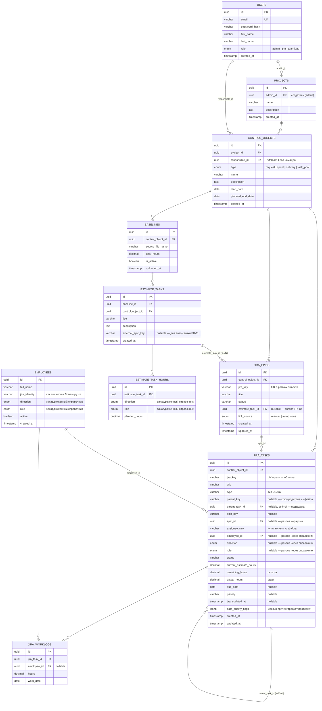

# Architecture

> Документ ведёт архитектор. Версия: **1.1 (25.06.2026)** — добавлен маппинг входных файлов (baseline + ADUsers).
> v1.0 — перепроектировано под «Функциональные требования.docx».
>
> ⚠️ Версия 0.1 описывала обобщённый agile-дашборд (Project → Sprint → Task + Estimate по отделам).
> ФТ описывают **инструмент baseline/actual-контроля для PM/Team Lead** — это другая доменная модель.
> Документ переписан целиком. Трассировка к FR — в конце каждого раздела и в матрице FR → реализация.

---

## Что меняется относительно v0.1

| Было (v0.1) | Стало (v1.0, под ФТ) |
|-------------|----------------------|
| `Project → Sprint → Task` (жёсткая иерархия) | `Project (админ) → ControlObject (заявка/спринт/поставка) → baseline/jira` |
| `Estimate` со столбцами часов по отделам | `Baseline → EstimateTask → EstimateTaskHours` (направление → роль → часы) |
| Отделы захардкожены в enum | Направления/роли — **захардкожены** (enum), значения из файлов матчатся через alias-маппинг |
| — | `Employee` (справочник сотрудник → направление → роль) |
| Обобщённый `Task` (self-ref) | `JiraEpic` + `JiraTask` (+ подзадачи self-ref) из Jira-выгрузки |
| `estimate_item.linked_task_id` (item ↔ task) | связка **Jira Epic ↔ Задача оценки** (1 эпик → 1 задача оценки) |
| Stats: суммы estimate vs task | Сравнение **baseline/actual** по уровням + риски + «Требует проверки» |
| AI: summary + risks (плоский текст) | AI-сводка с грунтингом: выводы → вопросы → рекомендации → объяснения |

**Переиспользуется из текущего кода:** auth (JWT/Passport), каркас NestJS-модулей, импорт Excel (`xlsx`), AI-каркас (OpenAI), дашборд-компоненты Vue/PrimeVue, response-interceptor, global-exception-filter.

---

## Стек

| Слой       | Технология                                      |
|------------|-------------------------------------------------|
| Backend    | NestJS, TypeScript, TypeORM, PostgreSQL         |
| Auth       | Passport.js + @nestjs/jwt                       |
| Validation | class-validator + class-transformer             |
| Импорт     | `xlsx` (Excel/CSV парсинг)                       |
| Frontend   | Vue 3 (Composition API), Vite, Pinia, PrimeVue  |
| AI         | **OpenAI API (gpt-4o)** — канон проекта          |
| Deploy     | Replit                                          |

> AI-провайдер зафиксирован как **OpenAI gpt-4o** (см. `ai.service.ts`). Старые упоминания Anthropic Claude в `instructions.md` устарели.

---

## Доменная модель (ERD)



### Ключевые связи и правила

- **Связка Epic ↔ Задача оценки** (FR-10): реализована как FK `estimate_task_id` на `JIRA_EPICS`.
  Один эпик связан максимум с одной задачей оценки; одна задача оценки — с N эпиков. `link_source` различает ручную и авто-связку (FR-11).
- **Несвязанные элементы** (FR-12) — вычисляются: эпик с `estimate_task_id = null`; задача оценки без эпиков; `JiraTask` с `epic_id = null` / `employee_id = null` / без факта / без даты.
- **Иерархия Jira** (FR-08): `JiraTask` может быть подзадачей (`parent_task_id`, self-ref). Резолв эпика: `epic_id` по `epic_key`, иначе подъём по `parent_key`/`parent_task_id` (подзадача → родительская задача → эпик). Факт подзадач агрегируется к родителю и эпику.
- **Факт** (FR-09): если в выгрузке есть worklog-строки — пишутся в `JIRA_WORKLOGS` и агрегируются в `JiraTask.actual_hours`; иначе берётся готовый факт из строки задачи. Распределение по роли/направлению — через `employee_id` (worklog) или через `assignee → Employee`.
- **Baseline неизменяем** (FR-02): загрузка Jira не трогает `BASELINES`/`ESTIMATE_TASKS`. Повторная загрузка baseline — явное действие (новая запись + `is_active`).
- **Направления и роли захардкожены** (отклонение от буквы FR-04 — по решению заказчика): `direction`/`role` — фиксированные enum в коде. Значения из baseline-файла и справочника сотрудников **матчатся** на них через alias-маппинг в импорт-сервисе (например `"Бэкенд" / "BE" / "backend" → direction.backend`). Не распознанные значения → «требует проверки» (FR-12). Этим выполняется дух FR-04 (нормализация к единому виду) при фиксированном наборе.

### Enum-типы PostgreSQL

```sql
CREATE TYPE user_role        AS ENUM ('admin', 'pm', 'teamlead');
CREATE TYPE control_obj_type AS ENUM ('request', 'sprint', 'delivery', 'task_pool');
CREATE TYPE epic_link_source AS ENUM ('manual', 'auto', 'none');

-- Захардкоженные справочники (выведены из файлов baseline + ADUsers — 7 направлений, 8 ролей):
CREATE TYPE direction AS ENUM ('backend','frontend','analytics','teamlead','qa','devops','design','other');
CREATE TYPE role      AS ENUM ('backend_dev','frontend_dev','analyst','techwriter','qa','devops','designer','teamlead','other');
-- Пары (направление → роль): см. раздел «Маппинг входных файлов».
-- 'other' — fallback для нераспознанных значений → «требует проверки» (FR-12).

-- Статусы/типы Jira и приоритеты хранятся как varchar:
-- значения приходят из выгрузки и заранее не фиксированы (FR-06).
```

### Индексы

```sql
CREATE INDEX idx_control_objects_project   ON control_objects(project_id);
CREATE INDEX idx_estimate_tasks_baseline   ON estimate_tasks(baseline_id);
CREATE INDEX idx_estimate_tasks_object     ON estimate_tasks(control_object_id);
CREATE INDEX idx_est_hours_task            ON estimate_task_hours(estimate_task_id);
CREATE INDEX idx_jira_epics_object         ON jira_epics(control_object_id);
CREATE INDEX idx_jira_epics_estimate_task  ON jira_epics(estimate_task_id);
CREATE UNIQUE INDEX uq_jira_epics_key      ON jira_epics(control_object_id, jira_key);
CREATE INDEX idx_jira_tasks_object         ON jira_tasks(control_object_id);
CREATE INDEX idx_jira_tasks_epic           ON jira_tasks(epic_id);
CREATE INDEX idx_jira_tasks_parent         ON jira_tasks(parent_task_id);
CREATE INDEX idx_jira_tasks_employee       ON jira_tasks(employee_id);
CREATE INDEX idx_jira_tasks_status         ON jira_tasks(status);
CREATE UNIQUE INDEX uq_jira_tasks_key      ON jira_tasks(control_object_id, jira_key);
CREATE INDEX idx_worklogs_task             ON jira_worklogs(jira_task_id);
CREATE INDEX idx_employees_direction       ON employees(direction);
```

---

## Маппинг входных файлов

> Зафиксировано по реальным образцам: `Шаблон плановой оценки.xlsx` (baseline) и `ADUsers.xlsx` (справочник).
> Направления/роли захардкожены; значения из файлов матчатся через alias-маппинг.

### Справочник направлений и ролей (захардкожен)

| Направление | Роль(и) | enum direction / role | Группа `MemberOf` (id роли) |
|-------------|---------|-----------------------|------------------------------|
| Бэкенд      | Бекенд-разработчик    | `backend` / `backend_dev`   | `back-team` |
| Фронтенд    | Frontend-разработчик  | `frontend` / `frontend_dev` | `front-team` |
| Аналитика   | Аналитик              | `analytics` / `analyst`     | `analytics-team` |
| Аналитика   | Техпис                | `analytics` / `techwriter`  | `techwrite-team` |
| QA          | QA                    | `qa` / `qa`                 | `qa-team` |
| DevOps      | DevOps                | `devops` / `devops`         | `sysadmin` |
| Дизайнер    | Дизайнер              | `design` / `designer`       | `designer-team` |
| Тимлид      | Тимлид                | `teamlead` / `teamlead`     | любая группа с суффиксом `-lead` |

Alias-словарь импорта (примеры написаний → enum): `"Бэкенд"/"Бекенд-разработчик"/"back-team" → backend/backend_dev` и т.д.
Нераспознанное значение → `other` + флаг «требует проверки» (FR-12).
Контрактные группы `agency-team`, `outsource`, `outstaff-team`, `project-team`, `support-team` — **шум**, при резолве роли игнорируются.

### Baseline — `Шаблон плановой оценки.xlsx`

Шапка из 3 строк (объединённые ячейки), данные с 4-й строки.

| Колонка(и) | Поле / правило |
|------------|----------------|
| A `№ п/п` | внешний номер задачи оценки |
| B `Подсистема/компонент` | **пропускается** |
| C `Наименование задачи` | `EstimateTask.title` |
| D `Описание/требования` | `EstimateTask.description` |
| E `Ключ Epic` | `EstimateTask.external_epic_key` (опционально, для авто-связки FR-11; в шаблоне пуст) |
| F `Оценки` (всего) | `total_hours` — контрольная сумма: считаем сами + сверяем с F |
| G | → `teamlead/teamlead` |
| H + K | → `analytics/analyst` (оценка **+** работа с рисками) |
| I + L + N | → `analytics/techwriter` (Аналитика-Техпис + Документация-Техпис) |
| P + Q | → `design/designer` |
| R + S | → `frontend/frontend_dev` |
| T + U | → `backend/backend_dev` |
| V + W | → `qa/qa` (Тест-кейс + QA) |
| X + Y | → `devops/devops` |
| J, M, O (`Ревью`) | **пропускаются** — не заносятся (ревью = время проверки другим исполнителем) |

**Правила нормализации:**
- `EstimateTaskHours.planned_hours` для пары (direction, role) = сумма всех её колонок, **включая «Оценка на работу с рисками»** (риск-часы суммируются с обычной оценкой).
- Строки-итоги/служебные (`ИТОГО трудозатраты по проекту`; строки без названия или с нулевым `total`, напр. «Администрирование», «Общая документация») **не создают** задачу оценки (FR-03).
- Неполная структура (нет ожидаемых колонок) → предупреждение (FR-03).

### Справочник сотрудников — `ADUsers.xlsx` (лист `AD Users`, 91 запись)

| Колонка | Поле `Employee` |
|---------|-----------------|
| `DisplayName` | `full_name` |
| `sAMAccountName` | `jira_identity` (основной ключ матчинга) |
| `mail` | резервный ключ матчинга |
| `MemberOf` | резолв роли по группе (см. таблицу выше) |
| `Роль` | `role` (источник истины, согласован с группами) |
| `Направление` | `direction` |

**Матчинг Jira-исполнителя** (FR-05, FR-09): по `sAMAccountName`, затем по `mail`. Не найденный исполнитель → «требует проверки».

### Jira-выгрузка — 2 файла

Проверено на образцах `Advanced Roadmaps_RoadMap ВЭИ_Объем…xlsx` (структура) + `Задачи проекта ВЭИ…xlsx` (трудозатраты), поставка `MERVEIDEV-235`. Импорт: `POST /control-objects/:id/jira/import` (`structureFile` + `worklogFile` + `deliveryKey`).

**Файл 1 — структура** (`Поставка → Epic → Задача`, связь по **имени** родителя):
| Колонка | Использование |
|---------|---------------|
| Иерархия | уровень: `Поставка` / `Epic` / иначе тип задачи (`Задача бэкенда`, `Ошибка` …) |
| Название | имя сущности; через него строится иерархия (Родительская задача == Название родителя) |
| Ключ задачи | `jiraKey` |
| Родительская задача | имя родителя (поставки для эпика, эпика для задачи) |
| Статус задачи, Приоритет | как есть |
| Целевая дата окончания → Срок выполнения | `dueDate` (первое непустое, иначе null) |
| Исполнитель | `assigneeRaw` задачи (ФИО, информативно) |

**Файл 2 — трудозатраты** (worklog, покрывает весь проект за период — фильтруется по поставке матчингом):
| Колонка | Использование |
|---------|---------------|
| Ключ задачи | `taskKey` (шаг 1 матчинга) |
| Ключ родителя | шаг 2 матчинга |
| Ссылка на эпик | имя эпика, шаг 3 (синтетическая задача) |
| Часов | факт |
| **Имя пользователя** (логин) | **основной ключ матчинга → `Employee.jiraIdentity`** (резолв 100%) |
| Полное имя | `assigneeRaw` (с пометками `[X]` — для матчинга не используется) |
| Тип задачи | `taskType` (доп. сигнал направления, FR-07) |
| Тема задачи | название синтетической задачи |

**Матчинг worklog (строгий порядок):** 1) по `Ключ задачи`; 2) по `Ключ родителя`; 3) по `Ссылка на эпик` → синтетическая задача (`isSynthetic`). Иначе — несопоставлено (часто = worklog других поставок за период, не ошибка). Идемпотентность: при повторе worklog и задачи пересоздаются, эпики upsert по ключу (ручные связки сохраняются).

> **Правки к исходному ТЗ (внесены):** исполнитель матчится по «Имя пользователя» (логин), а не «Полное имя»; название задачи в worklog — колонка «Тема задачи»; `taskType` используется как второй сигнал направления.

---

## Расчётный слой (бизнес-логика)

> Вынесен в отдельный `analytics`-модуль. Всё считается на лету из расчётных данных — никаких «магических» значений в AI.

### Сравнение baseline/actual (FR-13)

Считается на уровнях: **проект → задача оценки → связанный Jira Epic → направление → роль**.
Для каждого уровня:

```
baseline_hours   = Σ planned_hours (estimate_task_hours)
actual_hours     = Σ actual (jira_tasks через связанные эпики / worklogs)
deviation        = actual_hours - baseline_hours
usage_percent    = actual_hours / baseline_hours * 100
risk_status      = f(usage_percent, deadline, data_quality)   // см. FR-19
```

Если задача оценки не связана с эпиком — сравнение только по baseline + предупреждение (FR-13).

### Индикаторы риска (FR-19) — пороги фиксированы в MVP

| Цвет | Условие (любое) |
|------|-----------------|
| 🔴 red    | `usage_percent > 100` (перерасход) ИЛИ просрочен срок |
| 🟡 yellow | `usage_percent ≥ 80` (приближение к baseline, раннее предупреждение) ИЛИ срок < 1 дня |
| ⚪ grey   | неполные данные / несвязанный элемент (риск качества данных) |
| 🟢 green  | в норме |

> Факт эпика = Σ факта его задач (включая подзадачи). У каждого риска — явная причина (FR-19, FR-25).
> Пользовательская настройка порогов — после MVP.

### Контроль сроков (FR-18)

`planned_end_date` объекта + `due_date` задач → просроченные / близкие к сроку / без движения перед сроком.
Нет дат → предупреждение о неполных данных (не выдумываем).

### Блок «Требует проверки» / качество данных (FR-12)

Вычисляемый список: несвязанные эпики, несвязанные задачи оценки, `JiraTask` без эпика/исполнителя/роли/направления/факта/даты.
Каждому — причина (`data_quality_flags`). Эти ограничения передаются в AI как контекст (FR-12, FR-25).

---

## API Routes

Базовый префикс: `/api/v1`. Все, кроме auth, под `JwtAuthGuard`.

### Auth
| Метод | Путь            | Описание             |
|-------|-----------------|----------------------|
| POST  | /auth/register  | Регистрация          |
| POST  | /auth/login     | Вход, возврат JWT    |
| GET   | /auth/me        | Текущий пользователь |

### Проекты (создаёт admin)
| Метод  | Путь            | Описание                       | Guard       |
|--------|-----------------|--------------------------------|-------------|
| POST   | /projects       | Создать проект                 | JWT + admin |
| GET    | /projects       | Список проектов                | JWT         |
| GET    | /projects/:id   | Детали проекта                 | JWT         |
| PATCH  | /projects/:id   | Обновить проект                | JWT + admin |
| DELETE | /projects/:id   | Удалить проект                 | JWT + admin |

### Справочники (FR-04, FR-05)
| Метод  | Путь                       | Описание                                       |
|--------|----------------------------|------------------------------------------------|
| GET    | /directions                | Список направлений (захардкожен, read-only)    |
| GET    | /roles                     | Список ролей (захардкожен, read-only)          |
| GET    | /employees                 | Справочник сотрудников                         |
| POST   | /employees                 | Добавить сотрудника вручную                    |
| PATCH  | /employees/:id             | Редактировать сотрудника                       |
| DELETE | /employees/:id             | Удалить/деактивировать                         |
| POST   | /employees/import          | Импорт справочника из Excel/CSV                |

### Объекты контроля (FR-01) — внутри проекта
| Метод  | Путь                                       | Описание                          |
|--------|--------------------------------------------|-----------------------------------|
| POST   | /projects/:projectId/control-objects       | Создать объект контроля (PM/TL)   |
| GET    | /projects/:projectId/control-objects       | Объекты контроля проекта          |
| GET    | /control-objects/:id                       | Детали объекта                    |
| PATCH  | /control-objects/:id                       | Обновить                          |
| DELETE | /control-objects/:id                       | Удалить                           |

### Baseline и задачи оценки (FR-02, FR-03, FR-04, FR-16)
| Метод  | Путь                                    | Описание                              |
|--------|-----------------------------------------|---------------------------------------|
| POST   | /control-objects/:id/baseline/import    | Загрузить baseline (Excel/CSV)        |
| GET    | /control-objects/:id/baseline           | Активный baseline + сводка            |
| GET    | /control-objects/:id/estimate-tasks     | Список задач оценки                   |
| GET    | /estimate-tasks/:id                      | Задача оценки + часы по ролям/связки  |
| PATCH  | /estimate-tasks/:id                       | Ручное редактирование                 |

### Jira-выгрузка (FR-06, FR-07, FR-08, FR-09, FR-17)
| Метод  | Путь                                  | Описание                                       |
|--------|---------------------------------------|------------------------------------------------|
| POST   | /control-objects/:id/jira/import      | Импорт Jira-выгрузки (upsert по ключу)         |
| GET    | /control-objects/:id/jira/epics       | Таблица эпиков (фильтры/сортировка)            |
| GET    | /control-objects/:id/jira/tasks       | Таблица задач (фильтры: направление/роль/статус/риск/срок/приоритет) |
| GET    | /jira-epics/:id                       | Детали эпика + его задачи                       |
| GET    | /jira-tasks/:id                       | Детали задачи                                   |
| PATCH  | /jira-tasks/:id                       | Форма редактирования (доуточнение полей)       |

### Связки Epic ↔ Задача оценки (FR-10, FR-11)
| Метод  | Путь                                          | Описание                          |
|--------|-----------------------------------------------|-----------------------------------|
| POST   | /estimate-tasks/:id/epics/:epicId/link        | Ручная привязка эпика             |
| DELETE | /estimate-tasks/:id/epics/:epicId/link        | Разорвать связь                   |
| POST   | /control-objects/:id/auto-link                | Авто-связка по epic key           |

### Аналитика и дашборд (FR-13, FR-14, FR-15, FR-18, FR-19, FR-26)
| Метод | Путь                                      | Описание                                  |
|-------|-------------------------------------------|-------------------------------------------|
| GET   | /control-objects/:id/dashboard            | Верхнеуровневый дашборд                    |
| GET   | /control-objects/:id/comparison           | Сравнение baseline/actual по уровням       |
| GET   | /control-objects/:id/by-role-direction    | План/факт по направлениям и ролям          |
| GET   | /control-objects/:id/deadlines            | Контроль сроков                            |
| GET   | /control-objects/:id/risks                | Список рисков с причинами                   |
| GET   | /control-objects/:id/data-quality         | Блок «Требует проверки»                     |

> Фильтры (FR-26) — query-параметры на `/jira/tasks`, `/jira/epics`, `/risks`.

### AI (FR-20, FR-21, FR-24, FR-25)
| Метод | Путь                                | Описание                                            |
|-------|-------------------------------------|-----------------------------------------------------|
| POST  | /control-objects/:id/ai/summary     | AI-сводка: интерпретация + вопросы + рекомендации + объяснения |

Ответ структурирован (camelCase, гарантирован OpenAI structured outputs / json_schema strict), каждый пункт грунтован на показатель/сущность (`ref` = jiraKey эпика или название задачи оценки):

```json
{
  "generatedAt": "2026-06-25T12:00:00Z",
  "controlObject": { "id": "uuid", "name": "Заявка 5..." },
  "state": "Общая интерпретация состояния...",
  "mainRisks":      [{ "ref": "MERVEIDEV-3002", "title": "...", "level": "red", "text": "..." }],
  "questions":      [{ "ref": "MERVEIDEV-3002", "text": "Вопрос к команде..." }],
  "recommendations":[{ "ref": "MERVEIDEV-3002", "action": "переоценить задачу/эпик", "text": "..." }],
  "explanations":   [{ "ref": "MERVEIDEV-3002", "basis": "превышение факта над baseline" }],
  "dataGaps":       ["Чего не хватает в данных для вывода"],
  "copyText":       "Готовая сводка для копирования (FR-27)"
}
```

**Промпт-контракт AI:** контекст собирает `AiContextBuilder` строго из расчётного слоя (`AnalyticsService`: comparison, dashboard, risks, dataQuality) — никаких сырых данных. `action` рекомендаций ограничен enum допустимых действий (FR-24). Запрещено выдумывать факты; при неполных данных AI явно сообщает, чего не хватает (FR-20, FR-25). Передаются `limitations` — отсутствующие поля (`current_estimate`/`remaining`/`jira_updated_at`), о которых AI НЕ делает выводов. `dataQuality` передаётся как ограничение (FR-12). Провайдер — OpenAI gpt-4o (`OPENAI_MODEL`).

---

## Карта сайта (Frontend)

```
/                                   → redirect → /login или /control-objects
/login                              → Вход
/register                           → Регистрация

/employees                          → Справочник сотрудников (импорт, ручное добавление, правка)  [FR-05]

/projects                           → Список проектов (создание — только admin)
/projects/new                       → Форма создания проекта (admin)
/projects/:projectId                → Проект: список объектов контроля команд
/projects/:projectId/control-objects/new  → Форма создания объекта контроля (PM/TL)               [FR-01]

/control-objects/:id                → Обзор объекта контроля (табы ниже)
  ├── /dashboard                    → Верхнеуровневый дашборд: KPI, риски, предупреждения          [FR-14]
  ├── /baseline                     → Загрузка baseline + таблица задач оценки                     [FR-02,03,16]
  ├── /jira                         → Загрузка Jira-выгрузки + таблицы Epic / Task                 [FR-06,07,17]
  ├── /links                        → Связка Jira Epic ↔ задача оценки (ручная/авто)               [FR-10,11]
  ├── /comparison                   → Baseline/actual по уровням + по ролям/направлениям           [FR-13,15]
  ├── /deadlines                    → Контроль сроков                                              [FR-18]
  ├── /data-quality                 → «Требует проверки»                                           [FR-12]
  └── /ai                           → AI-сводка + кнопка «Скопировать сводку»                       [FR-20–25,27]
```

Кнопка **«Скопировать сводку»** (FR-27): копирует текст AI-сводки с датой формирования и названием объекта в буфер.

---

## JWT Payload

```json
{ "sub": "uuid", "email": "user@example.com", "role": "admin | pm | teamlead", "iat": 0, "exp": 0 }
```

Время жизни токена: **24h**. Refresh не реализуем (хакатон — релогин при истечении).
Администрирование пользователей упрощено (FR-01: «не требует сложного администрирования»).

**Роли:** `admin` создаёт проекты; `pm`/`teamlead` создают и ведут объекты контроля внутри проектов своей команды. Разграничение — `RolesGuard` (уже есть в коде).

---

## Матрица трассировки FR → реализация

| FR | Сущности / эндпоинты / экраны |
|----|-------------------------------|
| FR-01 | `Project (admin) → ControlObject`; `POST /projects/:id/control-objects`; формы создания |
| FR-02 | `Baseline (is_active)`; `POST /baseline/import`; неизменяемость при Jira-импорте |
| FR-03 | `EstimateTask`; пропуск служебных/итоговых строк; warning на неполной структуре |
| FR-04 | `EstimateTaskHours (direction+role enum)`; **захардкоженные справочники** + alias-маппинг из файлов (отклонение от буквы FR-04 по решению заказчика) |
| FR-05 | `Employee`; `/employees`, `POST /employees/import`, PATCH |
| FR-06 | `JiraTask`; `POST /jira/import` (upsert по ключу); фильтры/сортировка |
| FR-07 | `JiraEpic`/`JiraTask`; резолв эпика; группа «без эпика» |
| FR-08 | `parent_task_id` (подзадачи self-ref); `epic_id` резолв по `epic_key`/`parent_key`; агрегация факта подзадач к задаче/эпику |
| FR-09 | `JiraWorklog` + `actual_hours`; распределение по роли через `Employee` |
| FR-10 | FK `jira_epics.estimate_task_id`; `POST /estimate-tasks/:id/epics/:epicId/link` |
| FR-11 | `external_epic_key` + `link_source=auto`; `POST /auto-link` |
| FR-12 | `data_quality_flags`; `GET /data-quality`; `/data-quality` экран |
| FR-13 | `analytics`: comparison по уровням; `GET /comparison` |
| FR-14 | `GET /dashboard`; `/dashboard` экран |
| FR-15 | `GET /by-role-direction`; пары направление+роль |
| FR-16 | `GET /estimate-tasks`; `/baseline` экран |
| FR-17 | `GET /jira/epics`, `/jira/tasks`; `/jira` экран |
| FR-18 | `GET /deadlines`; `due_date`/`planned_end_date` |
| FR-19 | risk_status (4 цвета, пороги фиксированы); `GET /risks` |
| FR-20 | `POST /ai/summary` (state, deviations) |
| FR-21 | AI `questions[]` (грунтованы на сущности) |
| FR-24 | AI `recommendations[]` (как предложения) |
| FR-25 | AI `explanations[]` (basis на каждый вывод) |
| FR-26 | query-фильтры на таблицах/рисках *(Should)* |
| FR-27 | кнопка «Скопировать сводку» *(Should)* |

---

## Открытые вопросы

**Закрыто** (по образцам `Шаблон плановой оценки.xlsx` + `ADUsers.xlsx`, см. «Маппинг входных файлов»):
- ✅ Формат baseline, alias направлений/ролей, список ролей, риск-часы (суммируются), Ревью (пропуск), служебные строки.
- ✅ Формат справочника сотрудников; матчинг исполнителя — по `sAMAccountName`/`mail`; «айдишник роли» — группы `MemberOf`.

**Осталось** (нужны примеры файлов):
- ✅ **Формат Jira-выгрузки** — закрыто (см. «Jira-выгрузка — 2 файла»). Проверено на `MERVEIDEV-235`: 24 эпика, 288 задач, факт 1835.42 ч, резолв сотрудников 100%.
- [ ] **external_epic_key в baseline** (FR-11): в шаблоне колонка `Ключ Epic` пустая — в каком виде заказчик будет её проставлять для авто-связки.
- [ ] **Тип объекта контроля**: подтвердить набор `request | sprint | delivery | task_pool` (тип «поставка» = delivery).
- [ ] **Тимлид как направление**: в файлах Тимлид — отдельное направление+роль (а не роль внутри направления, как в FR-15). Принято по факту данных; подтвердить.
- [ ] **Fast-follow: поля `JiraTask`** `currentEstimateHours` / `remainingHours` / `jiraUpdatedAt` — колонки в файлах ЕСТЬ (file2: «Первоначальная оценка задачи», «Оставшееся время задачи»; file1: «Осталось (дн.)»), но импорт их пока не сохраняет. До добавления AI честно сообщает об их отсутствии (`limitations`/`dataGaps`) и не делает выводов о росте оценки / остатке / отсутствии движения.
- [x] **Порог жёлтого риска** изменён 85 → 80 (раннее предупреждение для PM/TL) по решению от плана AI-интеграции; код и architecture.md синхронизированы.
