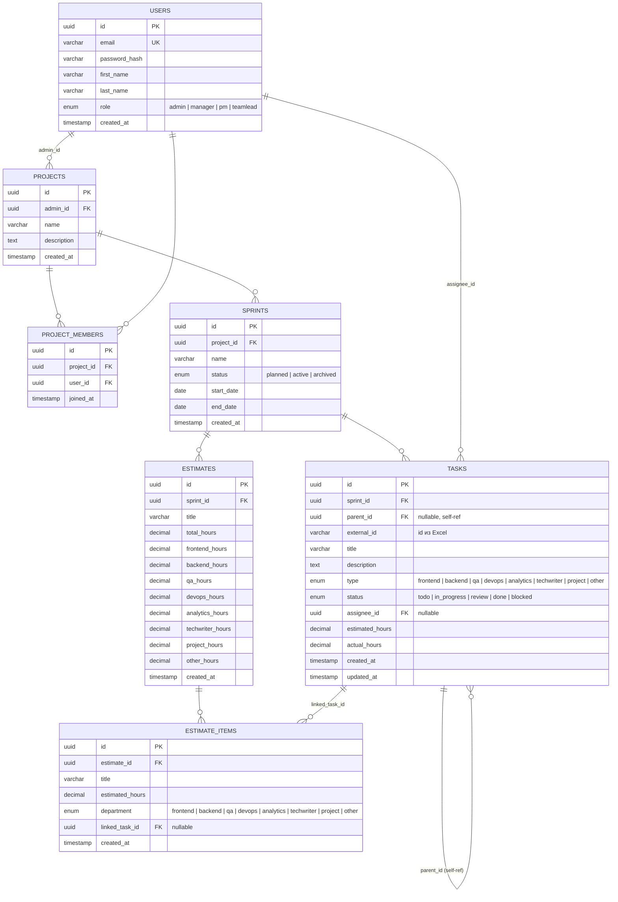

# Architecture

> Документ обновляется архитектором. Версия: 0.1 (25.06.2026)

---

## Стек

| Слой       | Технология                                      |
|------------|-------------------------------------------------|
| Backend    | NestJS, TypeScript, TypeORM, PostgreSQL         |
| Auth       | Passport.js + @nestjs/jwt                       |
| Validation | class-validator + class-transformer             |
| Frontend   | Vue 3 (Composition API), Vite, Pinia, PrimeVue  |
| AI         | Anthropic Claude API (claude-sonnet-4-6)        |
| Deploy     | Replit                                          |

---

## Схема БД



### Enum-типы PostgreSQL

```sql
CREATE TYPE user_role AS ENUM ('admin', 'manager', 'pm', 'teamlead');
CREATE TYPE sprint_status AS ENUM ('planned', 'active', 'archived');
CREATE TYPE task_type AS ENUM ('frontend', 'backend', 'qa', 'devops', 'analytics', 'techwriter', 'project', 'other');
CREATE TYPE task_status AS ENUM ('todo', 'in_progress', 'review', 'done', 'blocked');
CREATE TYPE department AS ENUM ('frontend', 'backend', 'qa', 'devops', 'analytics', 'techwriter', 'project', 'other');
```

### Индексы

```sql
-- Горячие запросы: задачи спринта, дерево задач, фильтрация по исполнителю/типу
CREATE INDEX idx_tasks_sprint_id ON tasks(sprint_id);
CREATE INDEX idx_tasks_parent_id ON tasks(parent_id);
CREATE INDEX idx_tasks_assignee_id ON tasks(assignee_id);
CREATE INDEX idx_tasks_type ON tasks(type);
CREATE INDEX idx_tasks_status ON tasks(status);
CREATE INDEX idx_sprints_project_id ON sprints(project_id);
CREATE INDEX idx_project_members_project_id ON project_members(project_id);
CREATE INDEX idx_estimate_items_estimate_id ON estimate_items(estimate_id);
```

---

## API Routes

Базовый префикс: `/api/v1`

### Auth
| Метод | Путь               | Описание              | Guard |
|-------|--------------------|-----------------------|-------|
| POST  | /auth/register     | Регистрация           | —     |
| POST  | /auth/login        | Вход, возврат JWT     | —     |
| GET   | /auth/me           | Текущий пользователь  | JWT   |

### Users
| Метод | Путь          | Описание              | Guard |
|-------|---------------|-----------------------|-------|
| GET   | /users        | Список всех (admin)   | JWT   |
| GET   | /users/:id    | Профиль пользователя  | JWT   |
| PATCH | /users/:id    | Обновить профиль      | JWT   |

### Projects
| Метод  | Путь                                | Описание                        | Guard |
|--------|-------------------------------------|---------------------------------|-------|
| POST   | /projects                           | Создать проект                  | JWT   |
| GET    | /projects                           | Мои проекты                     | JWT   |
| GET    | /projects/:id                       | Детали проекта                  | JWT   |
| PATCH  | /projects/:id                       | Обновить проект                 | JWT   |
| DELETE | /projects/:id                       | Удалить проект                  | JWT   |
| POST   | /projects/:id/members               | Добавить участника              | JWT   |
| DELETE | /projects/:id/members/:userId       | Удалить участника               | JWT   |
| GET    | /projects/:id/members               | Список участников               | JWT   |

### Sprints
| Метод  | Путь                                | Описание                        | Guard |
|--------|-------------------------------------|---------------------------------|-------|
| POST   | /projects/:projectId/sprints        | Создать спринт                  | JWT   |
| GET    | /projects/:projectId/sprints        | Список спринтов проекта         | JWT   |
| GET    | /sprints/:id                        | Детали спринта                  | JWT   |
| PATCH  | /sprints/:id                        | Обновить / сменить статус       | JWT   |
| DELETE | /sprints/:id                        | Удалить спринт                  | JWT   |

### Tasks
| Метод  | Путь                                | Описание                        | Guard |
|--------|-------------------------------------|---------------------------------|-------|
| POST   | /sprints/:sprintId/tasks/import     | Импорт из Excel (file upload)   | JWT   |
| GET    | /sprints/:sprintId/tasks            | Дерево задач спринта            | JWT   |
| GET    | /tasks/:id                          | Детали задачи                   | JWT   |
| PATCH  | /tasks/:id                          | Обновить задачу / статус        | JWT   |
| DELETE | /tasks/:id                          | Удалить задачу                  | JWT   |

### Estimates (Заявки)
| Метод  | Путь                                        | Описание                        | Guard |
|--------|---------------------------------------------|---------------------------------|-------|
| POST   | /sprints/:sprintId/estimates/import         | Импорт заявки из Excel          | JWT   |
| GET    | /sprints/:sprintId/estimates                | Список заявок спринта           | JWT   |
| GET    | /estimates/:id                              | Детали заявки с items           | JWT   |
| POST   | /estimate-items/:itemId/link/:taskId        | Связать item с таской           | JWT   |
| DELETE | /estimate-items/:itemId/link                | Разорвать связь                 | JWT   |

### Analytics / Dashboard
| Метод | Путь                                  | Описание                              | Guard |
|-------|---------------------------------------|---------------------------------------|-------|
| GET   | /sprints/:id/stats/tasks              | Статистика по задачам спринта         | JWT   |
| GET   | /sprints/:id/stats/estimates          | Статистика по заявкам спринта         | JWT   |
| GET   | /sprints/:id/stats/departments        | Часы по отделам                       | JWT   |
| GET   | /projects/:id/stats/overview          | Сводка по проекту (все спринты)       | JWT   |

### AI
| Метод | Путь                          | Описание                              | Guard |
|-------|-------------------------------|---------------------------------------|-------|
| POST  | /ai/sprint/:id/summary        | Саммари спринта через Claude          | JWT   |
| POST  | /ai/sprint/:id/risks          | Анализ рисков через Claude            | JWT   |

---

## Карта сайта (Frontend)

```
/                           → redirect → /login или /projects
/login                      → Страница входа
/register                   → Страница регистрации

/projects                   → Список проектов текущего пользователя
/projects/new               → Форма создания проекта
/projects/:id               → Обзор проекта (спринты, участники)
/projects/:id/members       → Управление участниками

/projects/:id/sprints/new           → Форма создания спринта
/projects/:id/sprints/:sprintId     → Обзор спринта (табы ниже)
  ├── /tasks                        → Дерево задач / импорт Excel
  ├── /kanban                       → Канбан доска (фильтры: отдел, исполнитель, статус)
  ├── /estimates                    → Список заявок
  ├── /estimates/:estimateId        → Детали заявки + линковка с тасками
  ├── /stats                        → Дашборд: графики, KPI, часы по отделам
  └── /ai                           → AI саммари и анализ рисков спринта
```

---

## JWT Payload

```json
{
  "sub": "uuid",
  "email": "user@example.com",
  "role": "admin | manager | pm | teamlead",
  "iat": 1234567890,
  "exp": 1234567890
}
```

Время жизни токена: **24h**. Refresh стратегия: не реализуем (хакатон — переlogин при истечении).

---

## Открытые вопросы

- [ ] Формат Excel файлов — нужны примеры для парсинга (колонки, типы данных)
- [ ] Матчинг исполнителей из Excel с `users` в БД — по ФИО? Что делать при несовпадении?
- [ ] `actual_hours` в Tasks — откуда берётся (из Excel или ручной ввод)?
- [ ] Статус задачи — из Excel или только ручной на канбане?
- [ ] Нужна ли история загрузок Excel (аудит)?
